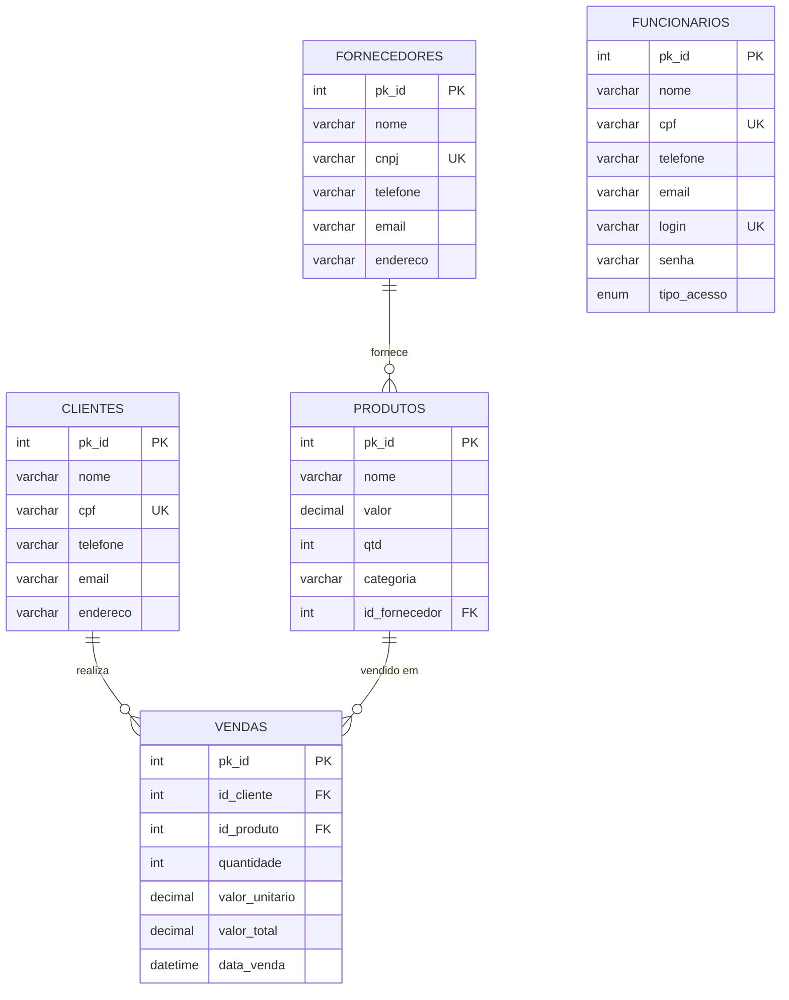

<h1 align="center">🛒 Sistema de Gestão - Mercadinho do Felipe</h1>

<p align="center">
  
  
  
  
  
  
  
</p>

<p align="center">
  <strong>Sistema Web Completo para Gestão de Pequenos Mercados</strong><br>
  Desenvolvido com padrão MVC, implementando controle de estoque automatizado com transações ACID
</p>

---

## 📑 Sumário

- [📖 Sobre o Projeto](#-sobre-o-projeto)
- [✨ Características](#-características)
- [🗄️ Banco de Dados](#️-banco-de-dados)
  - [Estrutura das Tabelas](#estrutura-das-tabelas)
  - [Diagrama de Relacionamento](#-diagrama-de-relacionamento-er)
- [🚀 Tecnologias](#-tecnologias)
- [📋 Pré-requisitos](#-pré-requisitos)
- [🎯 Instalação e Configuração](#-instalação-e-configuração)
- [📁 Estrutura do Projeto](#-estrutura-do-projeto)
- [🎯 Guia de Uso](#-guia-de-uso)
- [📸 Screenshots](#-screenshots-do-sistema)
- [👨‍💻 Desenvolvedores](#-desenvolvedores)

---

## 📖 Sobre o Projeto

O **Sistema de Gestão - Mercadinho do Felipe** é uma aplicação web completa desenvolvida em **Java** utilizando o padrão arquitetural **MVC (Model-View-Controller)** combinado com o padrão **DAO (Data Access Object)**. 

O sistema oferece uma solução robusta para gerenciamento de pequenos mercados, incluindo:

- ✅ **Gerenciamento Completo de CRUD**: Clientes, Fornecedores, Produtos e Vendas
- 🔄 **Controle de Estoque Automático**: Atualização em tempo real com cada venda
- 💾 **Transações ACID**: Garantia de integridade e consistência dos dados
- 🔐 **Controle de Acesso**: Dois níveis de usuários (Admin e Funcionário)
- 📊 **Relatórios e Consultas**: Buscas avançadas com múltiplos critérios
- 🎨 **Interface Responsiva**: Design moderno e intuitivo

### 🎓 Contexto Acadêmico

Este projeto foi desenvolvido como trabalho da disciplina de **Análise e Implementação de Software** com foco em:
- Aplicação prática do padrão MVC
- Implementação de transações em banco de dados
- Gerenciamento de sessões e autenticação
- Operações CRUD completas
- Integridade referencial e regras de negócio

---

## ✨ Características

### 🎯 Funcionalidades Principais

#### 👥 Gerenciamento de Clientes
- ✅ Cadastro completo com validação de **CPF único**
- 🔍 Consulta geral e consulta por ID
- ✏️ Alteração de dados cadastrais
- 🗑️ Exclusão com verificação de vendas vinculadas
- 📋 Campos: Nome, CPF, Telefone, Email, Endereço

#### 🏢 Gerenciamento de Fornecedores
- ✅ Cadastro com validação de **CNPJ único**
- 🔍 Consulta geral e por ID
- ✏️ Alteração de informações
- 🗑️ Exclusão com ajuste automático em produtos
- 📋 Campos: Nome, CNPJ, Telefone, Email, Endereço

#### 📦 Gerenciamento de Produtos
- ✅ Cadastro com vinculação **opcional** a fornecedor
- 🔍 Consulta geral, por ID e **busca por nome (parcial)**
- 📊 Controle de estoque integrado
- ✏️ Alteração de dados, preços e estoque
- 🗑️ Exclusão com verificação de vendas
- 📋 Campos: Nome, Valor, Quantidade (estoque), Categoria, ID Fornecedor

#### 💰 Gerenciamento de Vendas
- 🛒 Registro de vendas com **validação de estoque em tempo real**
- 🔄 **Atualização automática do estoque** ao realizar venda
- 💵 Cálculo automático de valores (unitário × quantidade)
- 🔍 Consulta geral e por ID com **nomes de clientes e produtos**
- ✏️ Alteração de vendas com **ajuste inteligente de estoque**
- ♻️ Exclusão com **restauração automática do estoque**
- ⏰ Registro de data/hora em **timezone brasileiro**
- 📋 Campos: ID Cliente, ID Produto, Quantidade, Valor Unitário, Valor Total, Data/Hora

### 🔐 Segurança e Controle de Acesso

#### Sistema de Autenticação

- 🔑 **Login Seguro**: Autenticação com usuário e senha
- 🛡️ **Controle de Sessão**: Verificação automática em todas as páginas protegidas
- 🚪 **Logout Seguro**: Encerramento completo da sessão

#### Perfis de Acesso

**👑 ADMIN (Administrador)**
- ✅ Acesso completo a todas as funcionalidades
- ✅ CRUD completo em todos os módulos
- ✅ Exclusão de registros
- ✅ Alteração de dados críticos

**👤 FUNCIONÁRIO**
- ✅ Consulta de produtos, fornecedores e clientes
- ✅ Cadastro de clientes e vendas
- ❌ Sem permissão para alterações e exclusões
- ❌ Sem acesso a dados críticos do sistema

### 🔒 Transações de Banco de Dados

- **ACID Completo**: Atomicidade, Consistência, Isolamento, Durabilidade
- **Rollback Automático**: Em caso de erro, todas as operações são desfeitas
- **Integridade Referencial**: Validação de chaves estrangeiras
- **Controle de Concorrência**: Gerenciamento de múltiplos acessos simultâneos

---

## 🗄️ Banco de Dados

### Estrutura das Tabelas

#### 👥 Tabela `clientes`

```sql
CREATE TABLE clientes (
    pk_id       INT AUTO_INCREMENT PRIMARY KEY,
    nome        VARCHAR(100) NOT NULL,
    cpf         VARCHAR(14) UNIQUE NOT NULL,
    telefone    VARCHAR(15),
    email       VARCHAR(100),
    endereco    VARCHAR(200)
);
```

#### 🏢 Tabela `fornecedores`

```sql
CREATE TABLE fornecedores (
    pk_id       INT AUTO_INCREMENT PRIMARY KEY,
    nome        VARCHAR(100) NOT NULL,
    cnpj        VARCHAR(18) UNIQUE NOT NULL,
    telefone    VARCHAR(15),
    email       VARCHAR(100),
    endereco    VARCHAR(200)
);
```

#### 📦 Tabela `produtos`

```sql
CREATE TABLE produtos (
    pk_id           INT AUTO_INCREMENT PRIMARY KEY,
    nome            VARCHAR(100) NOT NULL,
    valor           DECIMAL(10,2) NOT NULL,
    qtd             INT NOT NULL DEFAULT 0,
    categoria       VARCHAR(50),
    id_fornecedor   INT,
    FOREIGN KEY (id_fornecedor) REFERENCES fornecedores(pk_id)
        ON DELETE SET NULL
);
```

#### 💰 Tabela `vendas`

```sql
CREATE TABLE vendas (
    pk_id           INT AUTO_INCREMENT PRIMARY KEY,
    id_cliente      INT NOT NULL,
    id_produto      INT NOT NULL,
    quantidade      INT NOT NULL,
    valor_unitario  DECIMAL(10,2) NOT NULL,
    valor_total     DECIMAL(10,2) NOT NULL,
    data_venda      DATETIME NOT NULL,
    FOREIGN KEY (id_cliente) REFERENCES clientes(pk_id)
        ON DELETE RESTRICT,
    FOREIGN KEY (id_produto) REFERENCES produtos(pk_id)
        ON DELETE RESTRICT
);
```

#### 👤 Tabela `funcionarios`

```sql
CREATE TABLE funcionarios (
    pk_id       INT AUTO_INCREMENT PRIMARY KEY,
    nome        VARCHAR(100) NOT NULL,
    cpf         VARCHAR(14) UNIQUE NOT NULL,
    telefone    VARCHAR(15),
    email       VARCHAR(100),
    login       VARCHAR(50) UNIQUE NOT NULL,
    senha       VARCHAR(50) NOT NULL,
    tipo_acesso ENUM('ADMIN', 'FUNCIONARIO') NOT NULL
);
```

### 📊 Diagrama de Relacionamento (ER)



### 🛡️ Regras de Integridade

| Operação | Tabela | Restrição | Comportamento |
|----------|--------|-----------|---------------|
| DELETE | fornecedores | produtos.id_fornecedor | **SET NULL** - Produtos ficam sem fornecedor |
| DELETE | clientes | vendas.id_cliente | **RESTRICT** - Não permite exclusão se houver vendas |
| DELETE | produtos | vendas.id_produto | **RESTRICT** - Não permite exclusão se houver vendas |
| INSERT | produtos | id_fornecedor | Pode ser NULL (fornecedor opcional) |
| INSERT | vendas | id_cliente, id_produto | Obrigatórios e devem existir |
| UPDATE | vendas | quantidade | Ajusta estoque automaticamente |

---

## 🚀 Tecnologias

### Stack Completo

<table>
  <tr>
    <th>Camada</th>
    <th>Tecnologia</th>
    <th>Versão</th>
    <th>Descrição</th>
  </tr>
  <tr>
    <td><strong>Backend</strong></td>
    <td>Java (JDK)</td>
    <td>8+</td>
    <td>Linguagem principal do sistema</td>
  </tr>
  <tr>
    <td><strong>Web</strong></td>
    <td>JSP (JavaServer Pages)</td>
    <td>2.3+</td>
    <td>Camada de apresentação (View)</td>
  </tr>
  <tr>
    <td><strong>Frontend</strong></td>
    <td>HTML5, CSS3</td>
    <td>-</td>
    <td>Interface do usuário (server-side rendering)</td>
  </tr>
  <tr>
    <td><strong>Banco de Dados</strong></td>
    <td>MySQL</td>
    <td>5.7+ / 8.0+</td>
    <td>Persistência de dados</td>
  </tr>
  <tr>
    <td><strong>Servidor</strong></td>
    <td>Apache Tomcat</td>
    <td>8.5+ / 9.0+</td>
    <td>Servidor de aplicação</td>
  </tr>
  <tr>
    <td><strong>Driver JDBC</strong></td>
    <td>MySQL Connector/J</td>
    <td>8.0+</td>
    <td>Conexão Java-MySQL</td>
  </tr>
  <tr>
    <td><strong>Build</strong></td>
    <td>Apache Ant</td>
    <td>1.9+</td>
    <td>Automação de build</td>
  </tr>
  <tr>
    <td><strong>IDE</strong></td>
    <td>NetBeans</td>
    <td>8.2+</td>
    <td>Ambiente de desenvolvimento</td>
  </tr>
</table>

### Padrões de Projeto Utilizados

- 🏗️ **MVC (Model-View-Controller)**: Separação de responsabilidades
- 💾 **DAO (Data Access Object)**: Abstração de acesso a dados
- 🔌 **Factory Pattern**: Criação de conexões (ConectaBanco)
- 📦 **JavaBeans**: Encapsulamento de dados
- 🔄 **Transaction Script**: Gerenciamento de transações

---

## 📋 Pré-requisitos

Antes de começar, certifique-se de ter instalado em sua máquina:

### Software Necessário

| Software | Versão Mínima | Download |
|----------|---------------|----------|
| ☕ Java JDK | 8 ou superior | [Oracle JDK](https://www.oracle.com/java/technologies/downloads/) |
| 🐬 MySQL Server | 5.7 ou superior | [MySQL Downloads](https://dev.mysql.com/downloads/mysql/) |
| 🐱 Apache Tomcat | 8.5 ou superior | [Tomcat Downloads](https://tomcat.apache.org/download-90.cgi) |
| 🌐 Navegador Web | Versão atual | Chrome, Firefox, Edge, Safari |
| 💻 IDE (opcional) | - | [NetBeans](https://netbeans.apache.org/download/), Eclipse, IntelliJ |

---

## 🎯 Instalação e Configuração

### 1️⃣ Clone o Repositório

```bash
git clone https://github.com/seu-usuario/sistema-mercadinho-felipe.git
cd sistema-mercadinho-felipe
```

### 2️⃣ Configure o Banco de Dados

#### Opção A: Via Terminal MySQL

```bash
# Entre no MySQL
mysql -u root -p

# Execute o script
source script_bancodedados.sql

# Verifique as tabelas criadas
USE mercadinho_felipe;
SHOW TABLES;
```

#### Opção B: Via MySQL Workbench

1. Abra o MySQL Workbench
2. Conecte ao servidor local
3. File → Open SQL Script → selecione `script_bancodedados.sql`
4. Execute o script (⚡ ícone de raio)

### 3️⃣ Configure a Conexão com o Banco

Edite o arquivo `src/java/Config/ConectaBanco.java`:

```java
public class ConectaBanco {
    // Ajuste conforme sua configuração local
    private static final String URL = 
        "jdbc:mysql://localhost:3306/mercadinho_felipe" +
        "?useSSL=false" +
        "&serverTimezone=UTC" +
        "&useUnicode=true" +
        "&characterEncoding=UTF-8";
    
    private static final String USER = "root";  // Seu usuário MySQL
    private static final String PASSWORD = "sua_senha";  // Sua senha MySQL
}
```

### 4️⃣ Adicione o Driver JDBC

1. Baixe o [MySQL Connector/J](https://dev.mysql.com/downloads/connector/j/)
2. Extraia o arquivo `.jar`
3. Copie para `web/WEB-INF/lib/mysql-connector-java-X.X.XX.jar`

### 5️⃣ Compile e Execute

#### Usando NetBeans

1. Abra o NetBeans
2. File → Open Project → selecione a pasta do projeto
3. Clique com botão direito no projeto → Properties
4. Run → Server → selecione Apache Tomcat
5. Pressione **F6** ou clique em **Run**

#### Usando Linha de Comando

```bash
# Compile o projeto
ant clean build

# O arquivo .war será gerado em dist/

# Copie para o Tomcat
cp dist/ProjMercadinhoFelipe.war $TOMCAT_HOME/webapps/

# Inicie o Tomcat
cd $TOMCAT_HOME/bin
./startup.sh      # Linux/Mac
startup.bat       # Windows
```

### 6️⃣ Acesse o Sistema

Abra seu navegador e acesse:

```
http://localhost:8080/ProjMercadinhoFelipe/
```

### 🔑 Credenciais Padrão

O script do banco já cria dois usuários padrão:

**👑 Administrador**
- Login: `admin`
- Senha: `admin123`
- Acesso: Completo (CRUD em todos os módulos)

**👤 Funcionário**
- Login: `func`
- Senha: `func123`
- Acesso: Limitado (consultas e cadastro de vendas)

---

## 📁 Estrutura do Projeto

```
sistema-mercadinho-felipe/
│
├── 📂 src/java/                          # Código-fonte Java (Model + Config)
│   ├── 📂 Config/
│   │   └── 🔧 ConectaBanco.java         # Gerenciamento de conexões e transações
│   │
│   └── 📂 model/                         # Camada Model (MVC)
│       │
│       ├── 📄 Clientes.java              # Bean Cliente
│       ├── 📄 Fornecedores.java          # Bean Fornecedor
│       ├── 📄 Funcionario.java           # Bean Funcionário
│       ├── 📄 Produtos.java              # Bean Produto
│       ├── 📄 Vendas.java                # Bean Venda
│       │
│       └── 📂 DAO/                       # Data Access Objects
│           ├── 💾 ClienteDAO.java        # CRUD Clientes
│           ├── 💾 FornecedorDAO.java     # CRUD Fornecedores
│           ├── 💾 FuncionarioDAO.java    # Autenticação e CRUD
│           ├── 💾 ProdutoDAO.java        # CRUD Produtos
│           └── 💾 VendaDAO.java          # CRUD Vendas (com transações)
│
├── 📂 web/                               # Camada View + Controller (MVC)
│   │
│   ├── 🏠 index.jsp                      # Página principal
│   ├── 🔐 login.html                     # Tela de login
│   ├── 🔐 login.jsp                      # Processamento de autenticação
│   ├── 🚪 logout.jsp                     # Encerramento de sessão
│   ├── 🛡️ verificar_sessao.jsp           # Middleware de autenticação
│   │
│   ├── 📂 clientes/                      # Módulo Clientes
│   │   ├── index.jsp                     # Menu clientes
│   │   ├── cli_cad.html                  # Form cadastro
│   │   ├── cli_cad.jsp                   # Action cadastro
│   │   ├── cli_cons_geral.jsp            # Consulta geral
│   │   ├── cli_cons_id.html              # Form consulta ID
│   │   ├── cli_cons_id.jsp               # Action consulta ID
│   │   ├── cli_cons_id_alt.html          # Form consulta para alterar
│   │   ├── cli_cons_id_alt.jsp           # Action busca para alterar
│   │   ├── cli_alt.jsp                   # Action alteração
│   │   ├── cli_excluir_form.jsp          # Form confirmação exclusão
│   │   └── cli_exclui_action.jsp         # Action exclusão
│   │
│   ├── 📂 fornecedores/                  # Módulo Fornecedores
│   │   └── [mesma estrutura de clientes]
│   │
│   ├── 📂 produtos/                      # Módulo Produtos
│   │   ├── index.jsp                     # Menu produtos
│   │   ├── prod_cad.html                 # Form cadastro
│   │   ├── prod_cad.jsp                  # Action cadastro
│   │   ├── prod_cons_geral.jsp           # Consulta geral
│   │   ├── prod_cons_nome.html           # Form busca por nome
│   │   ├── prod_cons_nome.jsp            # Action busca nome
│   │   └── [demais arquivos CRUD]
│   │
│   ├── 📂 vendas/                        # Módulo Vendas (Transacional)
│   │   ├── index.jsp                     # Menu vendas
│   │   ├── vend_cad.html                 # Form cadastro venda
│   │   ├── vend_cad.jsp                  # Action cadastro (com transação)
│   │   ├── vend_cons_geral.jsp           # Consulta geral (com nomes)
│   │   ├── vend_alt.jsp                  # Action alteração (ajusta estoque)
│   │   ├── vend_exclui_action.jsp        # Action exclusão (restaura estoque)
│   │   └── [demais arquivos CRUD]
│   │
│   ├── 📂 style_geral/                   # Estilos CSS
│   │   ├── 🎨 estilos.css                # Estilos globais
│   │   └── 🎨 tabela.css                 # Estilos de tabelas
│   │
│   └── 📂 WEB-INF/
│       ├── web.xml                       # Configuração da aplicação web
│       └── 📂 lib/
│           └── mysql-connector-java.jar  # Driver JDBC MySQL
│
├── 📂 img/                               # Screenshots do sistema
│   ├── 📂 Login Admin/                   # 54 imagens Admin
│   └── 📂 Login Func/                    # 6 imagens Funcionário
│
├── 📜 script_bancodedados.sql            # Script criação banco
├── 📖 README.md                          # Este arquivo
├── 🔧 build.xml                          # Configuração Apache Ant
│
└── 📂 nbproject/                         # Configurações NetBeans
    ├── project.properties
    └── build-impl.xml
```

### Organização por Camadas MVC

| Camada | Localização | Responsabilidade |
|--------|-------------|------------------|
| **Model** | `src/java/model/` | Entidades (Beans) e lógica de negócio |
| **Model** | `src/java/model/DAO/` | Acesso a dados e persistência |
| **View** | `web/**/*.html` | Interface visual (formulários) |
| **View** | `web/**/*_cons_*.jsp` | Exibição de dados |
| **Controller** | `web/**/*_cad.jsp`, `*_alt.jsp` | Processamento de ações |
| **Config** | `src/java/Config/` | Configuração e infraestrutura |

---

## 🎯 Guia de Uso

### 📋 Fluxo Completo de Operação

#### 1️⃣ Configuração Inicial (Primeira Vez)

1. ✅ Execute o `script_bancodedados.sql`
2. ✅ Faça login como **ADMIN** (`admin` / `admin123`)
3. ✅ **Cadastre fornecedores** (opcional, mas recomendado)
4. ✅ **Cadastre produtos** (vincule aos fornecedores se desejar)
5. ✅ **Cadastre clientes**
6. ✅ Sistema pronto para vendas!

#### 2️⃣ Operação Diária - Funcionário

```
┌─────────────────────────────────────────────┐
│  1. Login no sistema (func/func123)         │
└────────────┬────────────────────────────────┘
             │
             ▼
┌─────────────────────────────────────────────┐
│  2. Consultar produtos disponíveis          │
│     → Verificar estoque                     │
│     → Consultar preços                      │
└────────────┬────────────────────────────────┘
             │
             ▼
┌─────────────────────────────────────────────┐
│  3. Registrar venda                         │
│     → Informar ID do cliente                │
│     → Informar ID do produto                │
│     → Informar quantidade                   │
└────────────┬────────────────────────────────┘
             │
             ▼
┌─────────────────────────────────────────────┐
│  4. Sistema processa automaticamente:       │
│     ✓ Valida se cliente existe              │
│     ✓ Valida se produto existe              │
│     ✓ Verifica estoque disponível           │
│     ✓ Calcula valor total                   │
│     ✓ Registra a venda                      │
│     ✓ Atualiza o estoque                    │
└────────────┬────────────────────────────────┘
             │
             ▼
┌─────────────────────────────────────────────┐
│  5. Consultar histórico de vendas           │
│     → Ver vendas do dia                     │
│     → Consultar vendas específicas          │
└─────────────────────────────────────────────┘
```

#### 3️⃣ Gerenciamento - Administrador

**📦 Módulo Produtos**
```
├── ➕ Cadastrar novos produtos
│   ├── Informar nome, valor, categoria
│   ├── Definir quantidade inicial (estoque)
│   └── Vincular a fornecedor (opcional)
│
├── 🔍 Consultar produtos
│   ├── Consulta geral (todos)
│   ├── Por ID (específico)
│   └── Por nome (busca parcial)
│
├── ✏️ Alterar produtos
│   ├── Modificar preços
│   ├── Atualizar categorias
│   ├── Ajustar estoque
│   └── Trocar fornecedor
│
└── 🗑️ Excluir produtos
    └── (Apenas se não houver vendas registradas)
```

**🏢 Módulo Fornecedores**
```
├── ➕ Cadastrar com CNPJ único
├── 🔍 Consultar informações
├── ✏️ Alterar dados de contato
└── 🗑️ Excluir (produtos ficam sem fornecedor)
```

**👥 Módulo Clientes**
```
├── ➕ Cadastrar com CPF único
├── 🔍 Consultar dados completos
├── ✏️ Alterar informações cadastrais
└── 🗑️ Excluir (apenas se não houver vendas)
```

**💰 Módulo Vendas**
```
├── ➕ Registrar nova venda
│   └── Com atualização automática de estoque
│
├── 🔍 Consultar histórico completo
│   └── Exibe nomes de clientes e produtos
│
├── ✏️ Alterar vendas
│   ├── Modificar quantidade (ajusta estoque)
│   ├── Trocar produto (ajusta ambos estoques)
│   └── Alterar cliente
│
└── 🗑️ Excluir vendas
    └── Restaura automaticamente o estoque
```

### 🔐 Diferenças entre Perfis de Acesso

<table>
  <thead>
    <tr>
      <th>Funcionalidade</th>
      <th align="center">👑 ADMIN</th>
      <th align="center">👤 FUNCIONÁRIO</th>
    </tr>
  </thead>
  <tbody>
    <tr>
      <td colspan="3"><strong>📦 PRODUTOS</strong></td>
    </tr>
    <tr>
      <td>Consultar</td>
      <td align="center">✅</td>
      <td align="center">✅</td>
    </tr>
    <tr>
      <td>Cadastrar</td>
      <td align="center">✅</td>
      <td align="center">❌</td>
    </tr>
    <tr>
      <td>Alterar</td>
      <td align="center">✅</td>
      <td align="center">❌</td>
    </tr>
    <tr>
      <td>Excluir</td>
      <td align="center">✅</td>
      <td align="center">❌</td>
    </tr>
    <tr>
      <td colspan="3"><strong>🏢 FORNECEDORES</strong></td>
    </tr>
    <tr>
      <td>Consultar</td>
      <td align="center">✅</td>
      <td align="center">✅</td>
    </tr>
    <tr>
      <td>Cadastrar</td>
      <td align="center">✅</td>
      <td align="center">❌</td>
    </tr>
    <tr>
      <td>Alterar</td>
      <td align="center">✅</td>
      <td align="center">❌</td>
    </tr>
    <tr>
      <td>Excluir</td>
      <td align="center">✅</td>
      <td align="center">❌</td>
    </tr>
    <tr>
      <td colspan="3"><strong>👥 CLIENTES</strong></td>
    </tr>
    <tr>
      <td>Consultar</td>
      <td align="center">✅</td>
      <td align="center">✅</td>
    </tr>
    <tr>
      <td>Cadastrar</td>
      <td align="center">✅</td>
      <td align="center">✅</td>
    </tr>
    <tr>
      <td>Alterar</td>
      <td align="center">✅</td>
      <td align="center">❌</td>
    </tr>
    <tr>
      <td>Excluir</td>
      <td align="center">✅</td>
      <td align="center">❌</td>
    </tr>
    <tr>
      <td colspan="3"><strong>💰 VENDAS</strong></td>
    </tr>
    <tr>
      <td>Consultar</td>
      <td align="center">✅</td>
      <td align="center">✅</td>
    </tr>
    <tr>
      <td>Cadastrar</td>
      <td align="center">✅</td>
      <td align="center">✅</td>
    </tr>
    <tr>
      <td>Alterar</td>
      <td align="center">✅</td>
      <td align="center">❌</td>
    </tr>
    <tr>
      <td>Excluir</td>
      <td align="center">✅</td>
      <td align="center">❌</td>
    </tr>
  </tbody>
</table>

### ⚡ Funcionalidades Especiais

#### 🔍 Busca Inteligente de Produtos

1. **Busca por ID**: Retorna produto específico
   ```
   Buscar ID: 5  →  Retorna apenas o produto com ID 5
   ```

2. **Busca por Nome Exato**: Match completo
   ```
   Buscar: "Arroz Integral 1kg"  →  Produto exato
   ```

3. **Busca Parcial** (LIKE): Encontra todos que contêm o termo
   ```
   Buscar: "arroz"
   Resultado: 
     - Arroz Integral 1kg
     - Arroz Branco 5kg
     - Arroz Parboilizado 2kg
   ```

#### 📊 Controle Automático de Estoque

**Ao Cadastrar Venda:**
```sql
-- Antes da venda
Produto: Arroz 1kg | Estoque: 100 unidades

-- Venda: 50 unidades

-- Sistema automaticamente:
UPDATE produtos SET qtd = qtd - 50 WHERE pk_id = 2;

-- Depois da venda
Produto: Arroz 1kg | Estoque: 50 unidades
```

**Ao Alterar Venda:**
```sql
-- Cenário 1: Aumentar quantidade da mesma venda
Venda Original: 50 unidades
Alteração: 70 unidades
Ajuste no estoque: -20 unidades (diferença)

-- Cenário 2: Mudar de produto
Produto A (original): +50 unidades (restaura)
Produto B (novo): -70 unidades (desconta)
```

**Ao Excluir Venda:**
```sql
-- Venda tinha: 50 unidades do produto ID 2

-- Sistema automaticamente:
UPDATE produtos SET qtd = qtd + 50 WHERE pk_id = 2;

-- Estoque restaurado!
```

#### 💵 Cálculo Automático de Valores

```java
// O sistema busca o valor do produto automaticamente
float valorUnitario = buscarValorDoProduto(idProduto);

// Calcula o total
float valorTotal = quantidade * valorUnitario;

// Exemplo:
// Produto: Feijão 1kg - R$ 8,50
// Quantidade: 50
// Valor Total = 50 × 8,50 = R$ 425,00
```

#### ⏰ Registro de Data e Hora

- **Timezone**: `America/Sao_Paulo` (Brasília - UTC-3)
- **Formato de Exibição**: `dd/MM/yyyy HH:mm:ss` → `21/11/2025 23:17:00`
- **Tipo no Banco**: `DATETIME` (precisão de segundos)
- **Tipo em Java**: `java.sql.Timestamp` (precisão de milissegundos)

### 🎨 Interface do Usuário

#### Paleta de Cores por Módulo

- 💗 **Rosa (#fa709a)**: Produtos
- 💙 **Azul**: Fornecedores
- 💚 **Verde**: Clientes
- 🧡 **Laranja/Amarelo**: Vendas

#### Mensagens de Feedback

```
✅ Verde   → Operação realizada com sucesso
⚠️ Amarelo → Atenção, validação necessária
❌ Vermelho → Erro, operação não realizada
ℹ️ Azul    → Informação, orientação ao usuário
```

---

## 📸 Screenshots do Sistema

### 🚀 Deploy e Configuração Inicial

<table>
  <tr>
    <td align="center">
      
      <br><b>Deploy no NetBeans</b>
    </td>
    <td align="center">
      
      <br><b>PHPMyAdmin - Banco de Dados</b>
    </td>
  </tr>
  <tr>
    <td align="center">
      
      <br><b>Tabela Vendas Inicial (Transacional)</b>
    </td>
    <td align="center">
      
      <br><b>Tabela de Funcionários</b>
    </td>
  </tr>
</table>

---

### 🔐 Login e Dashboard - Administrador

<table>
  <tr>
    <td align="center">
      
      <br><b>Tela de Login</b>
    </td>
    <td align="center">
      
      <br><b>Dashboard Principal</b>
    </td>
  </tr>
  <tr>
    <td align="center">
      
      <br><b>Menu Produtos</b>
    </td>
    <td align="center">
      
      <br><b>Menu Fornecedores</b>
    </td>
  </tr>
  <tr>
    <td align="center">
      
      <br><b>Menu Clientes</b>
    </td>
    <td align="center">
      
      <br><b>Menu Vendas</b>
    </td>
  </tr>
</table>

---

### 📦 Gerenciamento de Produtos - Admin

#### Cadastro de Produtos

<table>
  <tr>
    <td align="center">
      
      <br><b>Formulário de Cadastro</b>
    </td>
    <td align="center">
      
      <br><b>Produto Cadastrado com Sucesso</b>
    </td>
  </tr>
</table>

#### Consulta de Produtos

<table>
  <tr>
    <td align="center">
      
      <br><b>Consulta Geral de Produtos</b>
    </td>
    <td align="center">
      
      <br><b>Consultar Produto por ID</b>
    </td>
  </tr>
  <tr>
    <td align="center">
      
      <br><b>Resultado da Consulta por ID</b>
    </td>
    <td align="center">
      
      <br><b>Consultar Produto por Nome</b>
    </td>
  </tr>
  <tr>
    <td align="center">
      
      <br><b>Resultado da Busca por Nome</b>
    </td>
    <td align="center">
      
      <br><b>Consultar Produto para Alterar</b>
    </td>
  </tr>
</table>

#### Alteração de Produtos

<table>
  <tr>
    <td align="center">
      
      <br><b>Produto Carregado para Alteração</b>
    </td>
    <td align="center">
      
      <br><b>Formulário de Alteração</b>
    </td>
  </tr>
  <tr>
    <td align="center">
      
      <br><b>Produto Alterado com Sucesso</b>
    </td>
    <td align="center">
      
      <br><b>Formulário de Exclusão</b>
    </td>
  </tr>
</table>

#### Exclusão de Produtos

<table>
  <tr>
    <td align="center">
      
      <br><b>Confirmação de Exclusão</b>
    </td>
    <td align="center">
      
      <br><b>Produto Excluído com Sucesso</b>
    </td>
  </tr>
</table>

---

### 🏢 Gerenciamento de Fornecedores - Admin

#### Cadastro de Fornecedores

<table>
  <tr>
    <td align="center">
      
      <br><b>Formulário de Cadastro</b>
    </td>
    <td align="center">
      
      <br><b>Fornecedor Cadastrado com Sucesso</b>
    </td>
  </tr>
</table>

#### Consulta de Fornecedores

<table>
  <tr>
    <td align="center">
      
      <br><b>Consulta Geral de Fornecedores</b>
    </td>
    <td align="center">
      
      <br><b>Consultar Fornecedor por ID</b>
    </td>
  </tr>
  <tr>
    <td align="center">
      
      <br><b>Resultado da Consulta</b>
    </td>
    <td align="center">
      
      <br><b>Consultar Fornecedor para Alterar</b>
    </td>
  </tr>
</table>

#### Alteração e Exclusão de Fornecedores

<table>
  <tr>
    <td align="center">
      
      <br><b>Formulário de Alteração</b>
    </td>
    <td align="center">
      
      <br><b>Fornecedor Alterado com Sucesso</b>
    </td>
  </tr>
  <tr>
    <td align="center">
      
      <br><b>Formulário de Exclusão</b>
    </td>
    <td align="center">
      
      <br><b>Confirmação de Exclusão</b>
    </td>
  </tr>
</table>

---

### 👥 Gerenciamento de Clientes - Admin

#### Cadastro de Clientes

<table>
  <tr>
    <td align="center">
      
      <br><b>Formulário de Cadastro</b>
    </td>
    <td align="center">
      
      <br><b>Cliente Cadastrado com Sucesso</b>
    </td>
  </tr>
</table>

#### Consulta de Clientes

<table>
  <tr>
    <td align="center">
      
      <br><b>Consulta Geral de Clientes</b>
    </td>
    <td align="center">
      
      <br><b>Consultar Cliente por ID</b>
    </td>
  </tr>
  <tr>
    <td align="center">
      
      <br><b>Resultado da Consulta</b>
    </td>
    <td align="center">
      
      <br><b>Consultar Cliente para Alterar</b>
    </td>
  </tr>
</table>

#### Alteração e Exclusão de Clientes

<table>
  <tr>
    <td align="center">
      
      <br><b>Formulário de Alteração</b>
    </td>
    <td align="center">
      
      <br><b>Cliente Alterado com Sucesso</b>
    </td>
  </tr>
  <tr>
    <td align="center">
      
      <br><b>Formulário de Exclusão</b>
    </td>
    <td align="center">
      
      <br><b>Confirmação de Exclusão</b>
    </td>
  </tr>
</table>

---

### 💰 Gerenciamento de Vendas e Controle de Estoque - Admin

#### Cadastro de Vendas

<table>
  <tr>
    <td align="center">
      
      <br><b>Formulário de Cadastro de Venda</b>
    </td>
    <td align="center">
      
      <br><b>Venda Cadastrada com Sucesso</b>
    </td>
  </tr>
</table>

#### Consulta de Vendas e Controle de Estoque

<table>
  <tr>
    <td align="center">
      
      <br><b>Consulta Geral de Vendas</b>
    </td>
    <td align="center">
      
      <br><b>Estoque Atualizado Após Venda</b>
    </td>
  </tr>
  <tr>
    <td align="center">
      
      <br><b>Tabela de Vendas no Banco</b>
    </td>
    <td align="center">
      
      <br><b>Consultar Venda por ID</b>
    </td>
  </tr>
</table>

#### Alteração de Vendas

<table>
  <tr>
    <td align="center">
      
      <br><b>Formulário de Alteração de Venda</b>
    </td>
    <td align="center">
      
      <br><b>Venda Alterada com Sucesso</b>
    </td>
  </tr>
</table>

#### Exclusão de Vendas e Restauração de Estoque

<table>
  <tr>
    <td align="center">
      
      <br><b>Formulário de Exclusão de Venda</b>
    </td>
    <td align="center">
      
      <br><b>Venda Excluída - Estoque Restaurado</b>
    </td>
  </tr>
</table>

---

### 👤 Login e Dashboard - Funcionário

<table>
  <tr>
    <td align="center">
      
      <br><b>Tela de Login - Funcionário</b>
    </td>
    <td align="center">
      
      <br><b>Dashboard Principal - Funcionário</b>
    </td>
  </tr>
</table>

---

### 🔒 Controle de Acesso por Perfil - Funcionário

<table>
  <tr>
    <td align="center">
      
      <br><b>Menu Produtos - Acesso Limitado</b>
    </td>
    <td align="center">
      
      <br><b>Menu Fornecedores - Acesso Limitado</b>
    </td>
  </tr>
  <tr>
    <td align="center">
      
      <br><b>Menu Clientes - Acesso Limitado</b>
    </td>
    <td align="center">
      
      <br><b>Menu Vendas - Acesso Completo</b>
    </td>
  </tr>
</table>

---

## 👨‍💻 Desenvolvedores

<table align="center">
  <tr>
    <td align="center">
      <h3>👨‍💼 Felipe Soeiro Lopes</h3>
    </td>
  </tr>
  <tr>
    <td align="center">
      <h3>👩‍💼 Giovanna de Paula Lopes Santos</h3>
    </td>
  </tr>
  <tr>
    <td align="center">
      <h3>👨‍💼 Kauã da Silveira Nascimento Machado</h3>
    </td>
  </tr>
  <tr>
    <td align="center">
      <h3>👨‍💼 Victor Guimarães Felipe</h3>
    </td>
  </tr>
</table>

---

## 📄 Licença

Este projeto foi desenvolvido para fins **acadêmicos** como parte da disciplina de **Análise e Implementação de Software**.

**Universidade:** Universidade Mogi das Cruzes (UMC)  
**Curso:** Análise e Desenvolvimento de Sistemas  
**Disciplina:** Análise e Implementação de Software  
**Ano:** 2025

### 🎓 Objetivos Educacionais

Este projeto demonstra a aplicação prática de:
- ✅ Padrão Arquitetural MVC
- ✅ Programação Orientada a Objetos em Java
- ✅ Desenvolvimento Web com JSP
- ✅ Gerenciamento de Banco de Dados Relacional
- ✅ Implementação de Transações ACID
- ✅ Controle de Sessão e Autenticação
- ✅ Design de Interface Responsiva

---

<p align="center">
  <strong>⭐ Se este projeto te ajudou, considere dar uma estrela!</strong><br>
  <sub>Desenvolvido com ❤️ pela equipe Mercadinho do Felipe</sub>
</p>

<p align="center">
  
  
  
</p>

